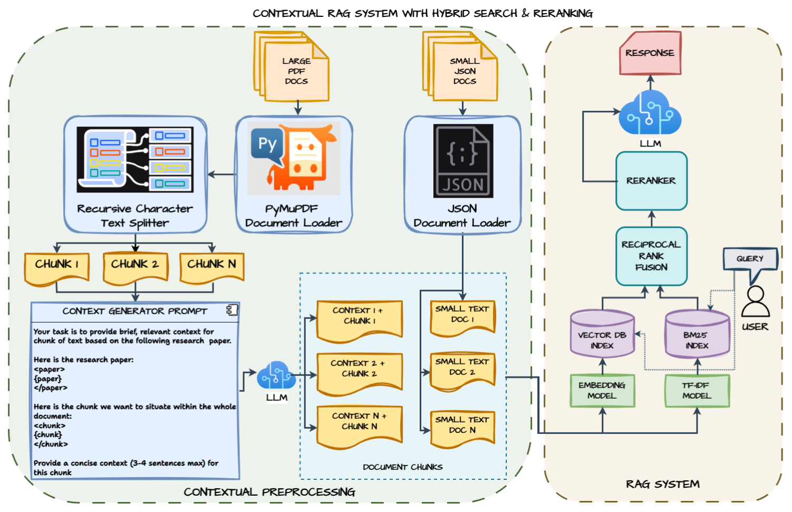

# Contextual RAG System with Hybrid Search and Reranking

One of the major challenges of naive RAG systems is getting the right retrieved context information to answer user queries. Chunking breaks down documents into smaller context  chunks which can often end up losing the overall context information relative to the whole document.

- Here we solve this problem by adding context information of the chunk relative to the whole document, to all the chunks.
- Improved the relavant chunk retrieval by **Hybrid Search** (Vector **Semantic** Similarity Search + **BM25** Keyword Search) and **Reranking**.

## Components

1. An LLM model (E.g. `GPT 4o-mini` or `Llama 3.2`).
2. Embedding model: OpenAI Embeddings (`text-embedding-3-small`) or Ollama Embeddings.
3. Chroma vector store to store embeddings and do vector semantic search.
4. BM25 Index to store TF-IDF vectors for keyword-based retrieval.
5. Ensemble Retriever for Hybrid Search.
6. Reranker model: `BAAI/bge-reranker-v2-m3`.
7. **LangChain** to orchestrate chain.

<!--  -->

## Method

### Document Preprocessing

- Loaded JSON and PDF documents with their metadata.
- Created document chunks of the PDF documents using standard methods like `Recursive Character Text Splitter` with thier metadata like page number and source title.

### Generate Chunk Context and Append

- Each chunk is enriched with contextual information relative to the source document using an LLM model (E.g. GPT 4o-mini or Llama 3.2).
- Used a prompt asking the model to provide a concise context (3-4 sentences max) for this chunk relative to the source document.
- The context is then prepended to the chunk text for enhanced retrieval.

### Index Document Chunks Embeddings in Vector DB for Semantic Search

- Used an embedding model (E.g. OpenAI `text-embedding-3-small` model or any open source model) to create vector representations of the contextualized chunks.
- Stored the embeddings in Chroma vector store, with Cosine Similarity search metric.

### BM25 Indexing for Keyword based Retrieval

- Store TF-IDF vectors of each chunk into BM25 Index.

### Ensemble Retriever with Reciprocal Rank Fusion

- Improved the relavant chunk retrieval by **Hybrid Search** (Vector **Semantic** Similarity Search + **BM25** Keyword Search).
- Got top-5 results from each method.
- Normalizes scores from both methods to a common scale (0-1).
- Weighted combination using the weight parameter and aggregates scores for documents appearing in both result sets.

### Reranking

- Used `BAAI/bge-reranker-v2-m3` model to rerank the results from the previous Ensemble Retriever, to improve retrieval quality.
- Query-document pairs are scored by the reranker and final ranking is based on reranker scores.
- Returns the top-k (default 5) documents after reranking.

### Build RAG Pipeline

- Design a RAG Prompt which takes query from the user and relavant context from documents using the Retriever, and produces answer.
- {question} + {context} -> rag_prompt_template -> llm.

